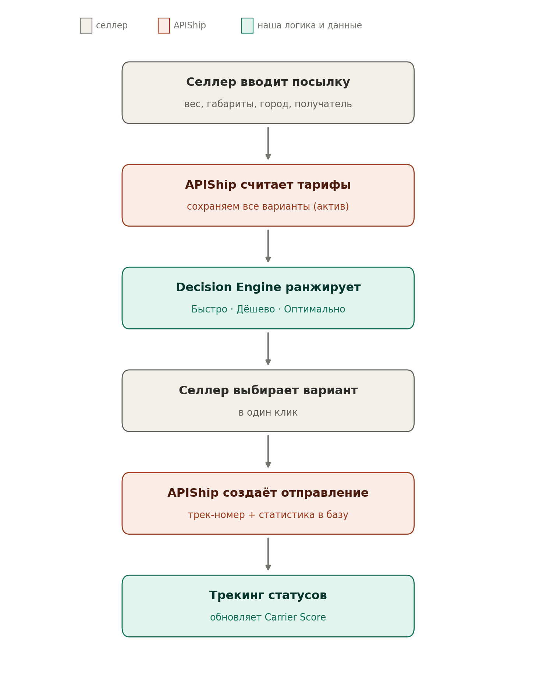

# Architecture — OCO Logistics (MVP)

Как устроен продукт изнутри. Cursor строит структуру по этому файлу. Главный принцип:
**бизнес-логику и интеграции держим отдельно, чтобы менять одно, не ломая другое.**

---

## 1. Общая картина

```
Селлер (браузер)
      │
      ▼
[apps/web] Next.js — экраны + серверные API-роуты
      │
      ├──► [packages/core] Decision Engine — правила «Быстро/Дёшево/Оптимально»
      ├──► [packages/integrations/apiship] — единственное место, где живёт APIShip
      └──► [packages/db] Prisma ──► PostgreSQL (на сервере в РФ)
```

- **apps/web** — всё, что видит пользователь, и серверная часть (API-роуты Next.js). На старте
  одно приложение, чтобы было меньше движущихся частей.
- **packages/core** — чистая бизнес-логика выбора доставки. Не знает ни про APIShip, ни про
  экраны. Это делает её простой и легко тестируемой.
- **packages/integrations/apiship** — весь обмен с APIShip за единым интерфейсом. Остальной код
  не знает, что под капотом именно APIShip → завтра можно заменить агрегатора, поменяв один модуль.
- **packages/db** — схема базы (Prisma) и доступ к данным (см. DATABASE.md).
- **packages/shared** — общие типы и утилиты.

## 2. Структура папок

```
oco-logistics/
├── .cursor/rules/          # агенты (см. первый пакет): 10 .mdc-файлов
├── docs/                   # ВСЕ эти документы (PRD, USER_STORIES, ROADMAP, DATABASE, ...)
├── apps/
│   └── web/                # Next.js: экраны + API-роуты
│       ├── app/            # страницы: dashboard, new-order, shipments, settings
│       ├── components/     # UI-компоненты (shadcn/ui)
│       └── lib/            # связки с core/integrations/db
├── packages/
│   ├── core/               # Decision Engine + расчёт Carrier Score
│   ├── integrations/
│   │   └── apiship/        # клиент APIShip: тарифы, ПВЗ, заказы, трекинг, валидация
│   ├── db/                 # prisma/schema.prisma, миграции, доступ к данным
│   └── shared/             # общие типы, утилиты, константы
├── infra/
│   ├── docker-compose.yml  # приложение + PostgreSQL
│   ├── .env.example
│   └── backups/            # скрипт ежедневного бэкапа базы
├── tests/                  # тесты логики и интеграций
└── README.md
```

**Почему это удобно менять:**
- Поменять вид экрана → только `apps/web`.
- Поменять правило выбора доставки → только `packages/core`.
- Заменить APIShip на другого агрегатора → только `packages/integrations`.
- Остальное при этом не трогается.

## 3. Главный поток: «Новый заказ»




1. Селлер заполняет форму посылки в `apps/web`.
2. API-роут вызывает `integrations.apiship.calculate()` → получает тарифы всех служб.
3. API-роут сохраняет **все** полученные варианты в `tariff_quotes` (актив, даже без заказа).
4. `core.rankOptions()` сортирует варианты и помечает «Быстро/Дёшево/Оптимально»
   (в «Оптимально» подмешивается Carrier Score).
5. UI показывает таблицу. Селлер выбирает вариант.
6. API-роут вызывает `integrations.apiship.createOrder()` → трек-номер + документы.
7. Сохраняется `shipment` со всей статистикой (обещанный срок, цена, перевозчик, категория, город).
8. Фоновая задача периодически вызывает `integrations.apiship.getStatus()` и пишет `tracking_events`,
   фиксирует фактические даты, возвраты; затем `core.recomputeCarrierScore()` обновляет рейтинг.

## 4. Технологии

Frontend/Backend: Next.js (App Router) + TypeScript + Tailwind + shadcn/ui.
База: PostgreSQL 16, ORM Prisma. Запуск: Docker Compose. Хостинг: российский сервер.
Код и имена — на английском; комментарии и общение с основателем — на русском.

## 5. Безопасность и закон (кратко; детали — в агенте «Безопасность»)
- Персональные данные получателей — только в нашей базе на сервере в РФ.
- ПДн не пишем в логи, URL, ошибки.
- Ключ APIShip — только на сервере (в `.env`), не на фронтенде.
- Секреты не попадают в git. HTTPS обязателен в бою.
