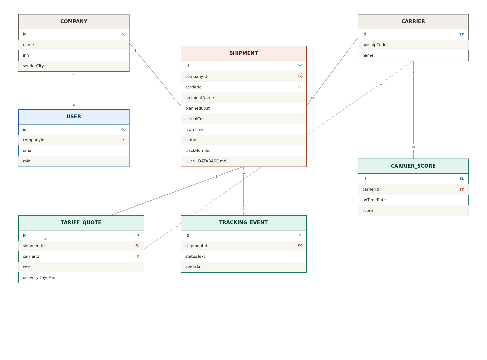

# Database Design — OCO Logistics (MVP)

Схема базы данных. Сначала — таблицы простыми словами, потом готовая схема Prisma, которую
Cursor использует для создания базы. Главная идея: **каждое отправление сохраняется как актив** —
с обещанным и фактическим сроком, ценой, возвратами. Это основа Carrier Score.



---

## 1. Таблицы простыми словами

- **Company (компания)** — бренд, который пользуется OCO. Название, ИНН, контакты, адрес отправителя.
- **User (пользователь)** — вход в кабинет: email, хэш пароля, к какой компании относится.
- **Carrier (перевозчик)** — служба доставки (СДЭК, Почта и т.д.), код в APIShip, активна ли.
- **Shipment (отправление)** — главная таблица. Одна посылка: что внутри, куда, кому, каким
  перевозчиком, статус, **обещанный срок и цена против фактических**, возврат/отмена.
- **TariffQuote (вариант доставки)** — все предложения, которые APIShip вернул на расчёт. Храним
  даже то, что селлер не выбрал — это данные о рынке (актив).
- **TrackingEvent (событие трекинга)** — история статусов посылки во времени (принято, на ПВЗ,
  доставлено). Из неё считаются фактические даты.
- **CarrierScore (рейтинг перевозчика)** — рассчитанная оценка 0–100 по доле доставок в срок и
  доле возвратов. Главный «ум» продукта.
- **AuditLog (журнал действий)** — кто что сделал (для безопасности и разбора инцидентов).

Персональные данные получателя (имя, телефон, адрес) лежат в Shipment и обязаны храниться только
на сервере в РФ.

## 2. Связи

- Company 1 — много User.
- Company 1 — много Shipment.
- Shipment 1 — много TariffQuote (варианты при расчёте).
- Shipment 1 — много TrackingEvent (история статусов).
- Carrier 1 — много Shipment / TariffQuote / CarrierScore.

## 3. Схема Prisma

Положить в `packages/db/prisma/schema.prisma`. Cursor создаст по ней базу командой миграции.
Комментарии — для понимания, поля можно расширять по ходу.

```prisma
generator client {
  provider = "prisma-client-js"
}

datasource db {
  provider = "postgresql"
  url      = env("DATABASE_URL")
}

enum UserRole {
  OWNER
  OPERATOR
}

enum ProductCategory {
  FASHION
  BEAUTY
  WELLNESS
  PET
  OTHER
}

enum PickupType {
  COURIER      // курьер до двери
  PVZ          // пункт выдачи
}

enum SelectionMode {
  FAST         // быстро
  CHEAP        // дёшево
  OPTIMAL      // оптимально (учитывает Carrier Score)
  MANUAL       // выбрал вручную
}

enum ShipmentStatus {
  DRAFT        // черновик (рассчитан, не создан)
  CREATED      // создан в службе, есть трек
  IN_TRANSIT   // в пути
  AT_PVZ       // в пункте выдачи
  DELIVERED    // доставлен
  RETURNED     // возврат
  CANCELED     // отменён
  PROBLEM      // проблема
}

model Company {
  id            String     @id @default(cuid())
  name          String
  inn           String?
  contactEmail  String
  senderCity    String?
  senderAddress String?
  apishipKeyRef String?    // ссылка/идентификатор секрета; сам ключ — в .env/секретах, не тут
  users         User[]
  shipments     Shipment[]
  createdAt     DateTime   @default(now())
  updatedAt     DateTime   @updatedAt
}

model User {
  id           String   @id @default(cuid())
  companyId    String
  company      Company  @relation(fields: [companyId], references: [id])
  email        String   @unique
  passwordHash String
  role         UserRole @default(OWNER)
  createdAt    DateTime @default(now())
}

model Carrier {
  id          String         @id @default(cuid())
  apishipCode String         @unique  // код службы в APIShip
  name        String
  isActive    Boolean        @default(true)
  shipments   Shipment[]
  quotes      TariffQuote[]
  scores      CarrierScore[]
}

model Shipment {
  id              String          @id @default(cuid())
  companyId       String
  company         Company         @relation(fields: [companyId], references: [id])
  createdByUserId String?

  // что за посылка
  category        ProductCategory @default(OTHER)
  weightG         Int             // вес в граммах
  lengthCm        Int
  widthCm         Int
  heightCm        Int
  declaredValue   Int?            // объявленная ценность, копейки

  // куда и кому (ПЕРСОНАЛЬНЫЕ ДАННЫЕ — только на сервере РФ, не в логи!)
  destCity        String
  destAddress     String?
  pvzCode         String?
  pickupType      PickupType      @default(PVZ)
  recipientName   String
  recipientPhone  String

  // выбор и перевозчик
  carrierId       String?
  carrier         Carrier?        @relation(fields: [carrierId], references: [id])
  selectionMode   SelectionMode?
  serviceCode     String?         // тариф/услуга службы

  // ОБЕЩАНО (план)
  plannedCost          Int?       // копейки
  plannedDeliveryDays  Int?
  plannedDeliveryDate  DateTime?

  // ФАКТ
  actualCost           Int?
  pickedUpAt           DateTime?  // забор
  arrivedAtPvzAt       DateTime?
  deliveredAt          DateTime?
  isOnTime             Boolean?   // уложились ли в срок
  isReturned           Boolean    @default(false)
  isCanceled           Boolean    @default(false)
  returnReason         String?

  // связь со службой
  apishipOrderId       String?
  trackNumber          String?

  status          ShipmentStatus  @default(DRAFT)
  legalBasisConfirmed Boolean     @default(false) // селлер подтвердил основание на обработку ПДн получателя

  quotes          TariffQuote[]
  trackingEvents  TrackingEvent[]
  createdAt       DateTime        @default(now())
  updatedAt       DateTime        @updatedAt

  @@index([companyId, status])
  @@index([trackNumber])
}

model TariffQuote {
  id               String   @id @default(cuid())
  shipmentId       String?
  shipment         Shipment? @relation(fields: [shipmentId], references: [id])
  carrierId        String
  carrier          Carrier   @relation(fields: [carrierId], references: [id])
  serviceCode      String
  cost             Int       // копейки
  deliveryDaysMin  Int?
  deliveryDaysMax  Int?
  pickupType       PickupType
  rawResponse      Json?     // полный ответ APIShip (без лишних ПДн)
  createdAt        DateTime  @default(now())

  @@index([shipmentId])
  @@index([carrierId])
}

model TrackingEvent {
  id          String   @id @default(cuid())
  shipmentId  String
  shipment    Shipment @relation(fields: [shipmentId], references: [id])
  statusCode  String
  statusText  String
  location    String?
  eventAt     DateTime
  rawResponse Json?
  createdAt   DateTime @default(now())

  @@index([shipmentId])
}

model CarrierScore {
  id          String          @id @default(cuid())
  carrierId   String
  carrier     Carrier         @relation(fields: [carrierId], references: [id])
  category    ProductCategory?  // можно считать по категории, иначе общий
  region      String?           // можно считать по региону, иначе общий
  onTimeRate  Float            // доля доставок в срок 0..1
  returnRate  Float            // доля возвратов 0..1
  sampleSize  Int              // на скольких отправлениях посчитано
  score       Int              // итог 0..100
  computedAt  DateTime         @default(now())

  @@index([carrierId])
}

model AuditLog {
  id         String   @id @default(cuid())
  userId     String?
  action     String   // например "shipment.create"
  entityType String?
  entityId   String?
  createdAt  DateTime @default(now())

  @@index([userId])
}
```

## 4. Как Carrier Score считается (MVP, просто)

Для перевозчика с достаточным числом доставок (например, от 20):
`score = round( (onTimeRate * 0.7 + (1 - returnRate) * 0.3) * 100 )`.
Где `onTimeRate` — доля посылок, доставленных не позже обещанного срока, `returnRate` — доля
возвратов. Формулу потом улучшим на реальных данных — поэтому она живёт в `packages/core`,
где её легко поменять.

## 5. Важные правила
- Ни одно отправление не создаётся/не обновляется без записи плановых и фактических полей.
- Все варианты расчёта (`TariffQuote`) сохраняются, даже если заказ не создан.
- Персональные данные — только в этой базе на сервере РФ, никогда в логах/URL.
- Цены храним в копейках (целые числа), чтобы не было ошибок округления.
- **Изоляция компаний:** каждый запрос к данным ограничен `companyId` текущего пользователя;
  данные одной компании недоступны другой. Реализуем через общий помощник доступа к данным.
- **Удаление данных (152-ФЗ):** предусмотреть возможность удалить персональные данные получателя
  по запросу. На старте — простое удаление/обезличивание записи; автоматизацию добавим позже.
